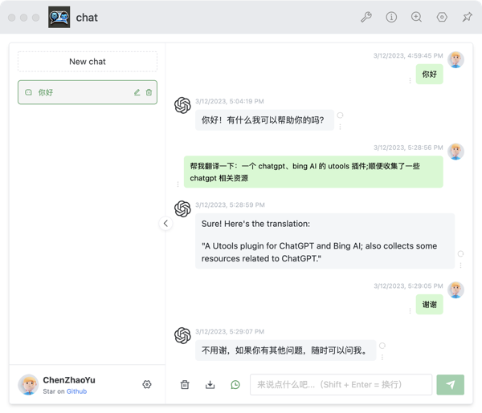

# utools-chat

A Utools plugin for ChatGPT and Bing AI.

一个 chatgpt、bing AI 的 utools 插件。

this project derived from [Chanzhaoyu/chatgpt-web](https://github.com/chanzhaoyu/chatgpt-web.git)

# 功能

1. 借助 utools 本地操作（只需要填写接口配置即可）
2. 所有参数可配置（所有配置存储在 utools 数据库中）
3. 方便快捷，随用随走

# 配置

初次进入可配置以下配置：

| 配置                  | 描述                | 备注                                                                                                                                |
| --------------------- | ------------------- | ----------------------------------------------------------------------------------------------------------------------------------- |
| `OPENAI_API_KEY`      | `OpenAI API` 二选一 | 二选一 , 使用 `OpenAI API` 所需的 `apiKey` [(获取 apiKey)](https://platform.openai.com/overview)                                    |
| `OPENAI_ACCESS_TOKEN` | `Web API` 二选一    | 二选一 , 同时存在时，`OPENAI_API_KEY` 优先, [(获取 accessToken)](https://chat.openai.com/api/auth/session)                          |
| `OPENAI_API_BASE_URL` | API 接口地址        | 可选，设置 `OPENAI_API_KEY` 时可用                                                                                                  |
| `OPENAI_API_MODEL`    | API 模型            | 可选，设置 `OPENAI_API_KEY` 时可用                                                                                                  |
| `API_REVERSE_PROXY`   | 反向代理            | 可选，设置 `OPENAI_ACCESS_TOKEN` 时可用，`Web API` [反向代理地址](https://github.com/transitive-bullshit/chatgpt-api#reverse-proxy) |
| `TIMEOUT`             | 超时                | 可选 ，单位 s                                                                                                                       |
| `SOCKS_PROXY_HOST`    | Socks 代理          | 可选，和 `SOCKS_PROXY_PORT` 一起时生效                                                                                              |
| `SOCKS_PROXY_PORT`    | Socks 代理端口      | 可选，和 `SOCKS_PROXY_HOST` 一起时生效                                                                                              |

# TODO

- [ ] 错误信息，前端显示
- [ ] 所有数据存储在 utools 本地
- [ ] 接入 Bing AI
- [ ] 或者提供个人接口，以同步所有数据？？
